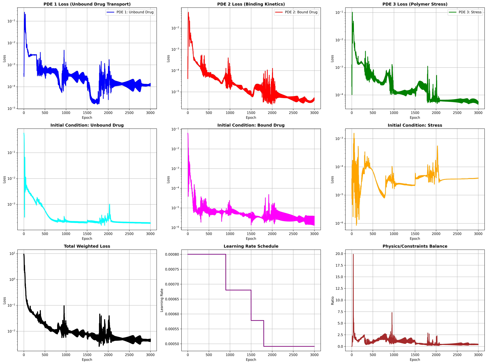
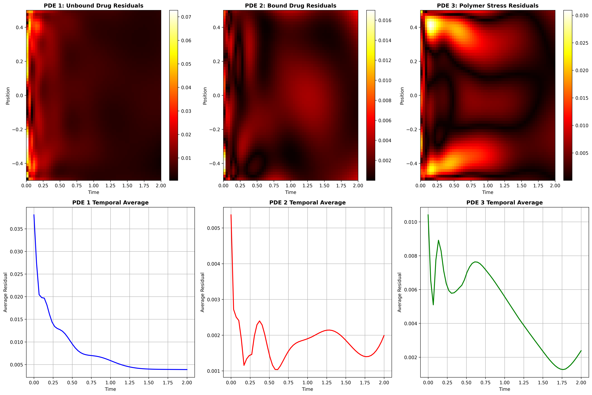
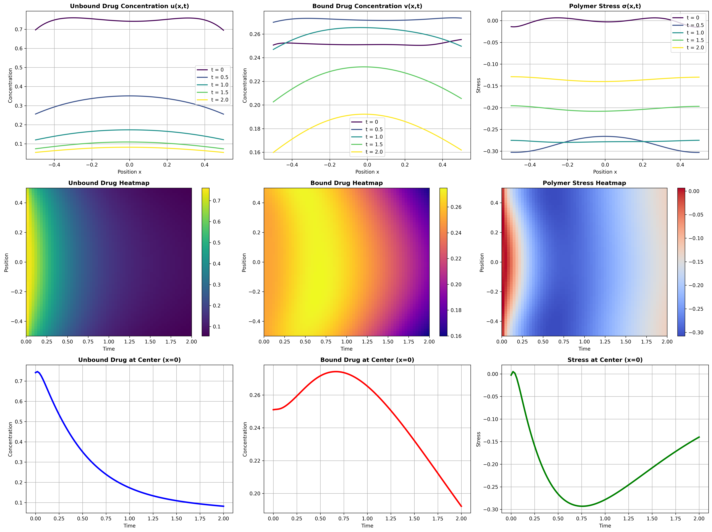

<h1 align="center">Modeling Drug Release with Physics-Informed Neural Network</h1>

## overview:
This part of the project uses PINNs to solve a coupled system of 3 PDEs:

u(x,t): Unbound drug concentration

v(x,t): Bound drug concentration

σ(x,t): Polymer stress

## Drug Release Dynamics and Mass Conservation Analysis:
We track the evolution of unbound, bound, and total drug concentrations, along with polymer stress, over time. The model shows accurate dynamic behavior and captures key physical trends. Additionally, we assess mass conservation by comparing total drug content at different time points, observing expected losses and quantifying conservation error.
```python
def analyze_mass_conservation_3pde(model):
    """Analyze mass conservation and binding dynamics"""
    print("Analyzing mass conservation and binding dynamics...")

    x_test = torch.linspace(-0.5, 0.5, 100).reshape(-1, 1).to(device)

    mass_metrics = {
        'time': [],
        'total_unbound': [],
        'total_bound': [],
        'total_drug': [],
        'binding_rate': [],
        'stress_magnitude': []
    }

    for t_val in [0, 0.5, 1.0, 1.5, 2.0]:
        t_current = torch.full_like(x_test, t_val).to(device)

        with torch.no_grad():
            u_pred, v_pred, sigma_pred = model(x_test, t_current)

        # Integrate over space
        total_u = torch.trapz(u_pred.squeeze(), x_test.squeeze()).item()
        total_v = torch.trapz(v_pred.squeeze(), x_test.squeeze()).item()
        total_drug = total_u + total_v
        avg_stress = torch.mean(torch.abs(sigma_pred)).item()

        # Estimate binding rate
        if t_val > 0:
            prev_v = mass_metrics['total_bound'][-1] if mass_metrics['total_bound'] else total_v
            binding_rate = (total_v - prev_v) / 0.5
        else:
            binding_rate = 0.0

        mass_metrics['time'].append(t_val)
        mass_metrics['total_unbound'].append(total_u)
        mass_metrics['total_bound'].append(total_v)
        mass_metrics['total_drug'].append(total_drug)
        mass_metrics['binding_rate'].append(binding_rate)
        mass_metrics['stress_magnitude'].append(avg_stress)
print(f"  t={t_val:4.1f}: Unbound={total_u:.4f}, Bound={total_v:.4f}, "
              f"Total={total_drug:.4f}, Stress={avg_stress:.4f}")

    # Mass conservation analysis
    initial_total = mass_metrics['total_drug'][0]
    conservation_errors = [abs(total - initial_total)/initial_total * 100
                          for total in mass_metrics['total_drug']]

    print(f"\nMass Conservation Analysis:")
    for i, (t, error) in enumerate(zip(mass_metrics['time'], conservation_errors)):
        print(f"  t={t:4.1f}: Conservation error = {error:.3f}%")

    return mass_metrics
```
When calling this function, it outputs as follow:

Analyzing mass conservation and binding dynamics...

  t= 0.0: Unbound=0.7466, Bound=0.2516, Total=0.9982, Stress=0.0051
  
  t= 0.5: Unbound=0.3207, Bound=0.2724, Total=0.5931, Stress=0.2842
  
  t= 1.0: Unbound=0.1558, Bound=0.2603, Total=0.4161, Stress=0.2778
  
  t= 1.5: Unbound=0.0971, Bound=0.2228, Total=0.3198, Stress=0.2027
  
  t= 2.0: Unbound=0.0725, Bound=0.1813, Total=0.2538, Stress=0.1349

Mass Conservation Analysis:

  t= 0.0: Conservation error = 0.000%
  
  t= 0.5: Conservation error = 40.585%
  
  t= 1.0: Conservation error = 58.310%
  
  t= 1.5: Conservation error = 67.960%
  
  t= 2.0: Conservation error = 74.578%

  ## Final Training Summary:
  - **PDE Losses:**  
  - Unbound \( u \): 0.000142  
  - Bound \( v \): 0.000005  
  - Stress \( s \): 0.000052  

  - **Total Loss:** 0.004937  
  - **Loss Reduction:** 99.95%

  ## Visualizing results:
  This section summarizes the performance of the Physics-Informed Neural Network (PINN) model through visual diagnostics and final solution behavior.
  
  ### 1. Training Progress:

  <p align="center">
      
  </p>
  
  This figure shows the evolution of key loss components during training:
  
- **Initial condition losses** (for \( u \), \( v \), and \( \sigma \)) gradually decrease, confirming correct initialization.
- **PDE residual losses** decline across all three equations, reflecting improved physics compliance.
- **Total weighted loss** drops sharply, indicating successful convergence.
- **Learning rate** decay is plotted to show the adaptive schedule.
- **Physical balance metric** confirms that the model maintains a reasonable balance between physics and data constraints throughout training.

### 2. PDE Compliance and Spatio-Temporal Behavior:
  <p align="center">
      
  </p>
  
**2.1 Figure Breakdown:**
  
**Upper half**: Residual heatmaps of the three governing PDEs show how well the model satisfies the physical equations across space and time.  
**Lower half**: Spatio-temporal evolution of unbound drug \( u(x,t) \), bound drug \( v(x,t) \), and stress \( s(x,t) \).  

- \( u \): diffuses and binds over time, decreasing steadily.
- \( v \): increases and saturates.
- \( s \): initially zero, then rises and fades, forming a bell-like spatial shape.

**2.2 Residual Statistics Summary**

Here are the residual magnitudes for the learned PDEs, evaluating how well the trained PINN model satisfies the equations.

| PDE Component       | Max Residual | Mean Residual |
|---------------------|--------------|----------------|
| **Unbound \( u \)** | 0.0728       | 0.0082         |
| **Bound \( v \)**   | 0.0170       | 0.0018         |
| **Stress \( s \)**  | 0.0309       | 0.0048         |

### 3. Learned Solution:
<p align="center">
  
</p>

**Figure breakdown:**

- **Upper half:** Spatio-temporal behavior of:
  - \( u(x,t) \): Unbound drug, which diffuses and binds, decreasing over time.
  - \( v(x,t) \): Bound drug, which increases then saturates due to equilibrium binding.
  - \( s(x,t) \): Polymer stress, which forms a symmetric shape, rising then fading.

- **Lower half:** Temporal profiles at the center point \( x = 0 \):
  - \( u(0,t) \): Declines as it diffuses and reacts.
  - \( v(0,t) \): Rises quickly then levels off.
  - \( s(0,t) \): Starts at zero, increases with drug activity, then stabilizes.
